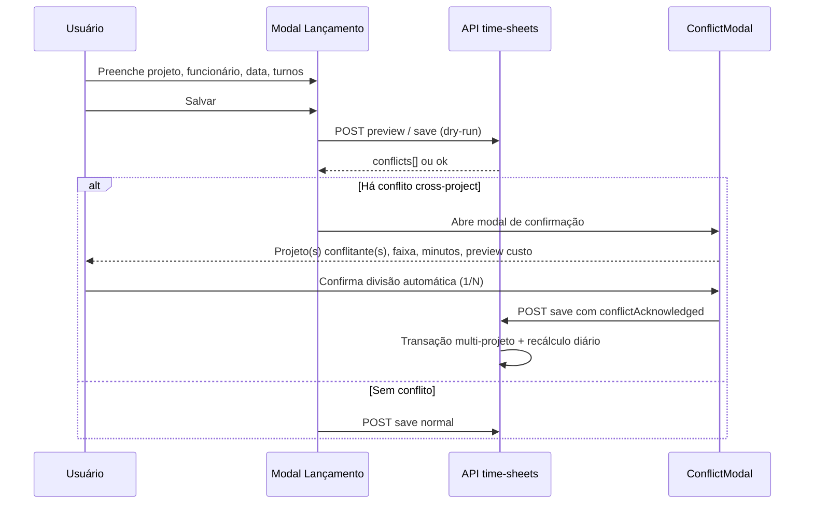

# ADR-0008 - Conflito de Horários entre Projetos e Divisão Proporcional

- Status: APROVADO
- Data: 2026-06-17
- Origem: Planejamento de produto — lançamento de horas multi-projeto

## Contexto

Um colaborador pode lançar horas em mais de um projeto no mesmo dia. Hoje cada `TimeSheetEntry` pertence a um par `(projeto, funcionário, mês)` e o cálculo de jornada (normal, extra 50%, extra 100%, sábado, domingo, feriado) é feito **por lançamento isolado**, sem considerar o total físico do dia em outros projetos.

A validação de sobreposição atual cobre apenas:

1. Intervalos dentro do mesmo lançamento (até 4 turnos).
2. Lançamentos do **mesmo projeto + mesmo funcionário + mesmo dia** (tela Ficha Tempo).
3. Lotes enviados no mesmo `POST` (API).

Não há detecção nem tratamento quando o **mesmo funcionário** lança horas **no mesmo dia e faixa horária** em **projetos diferentes**. O modal global do Header também não consulta lançamentos existentes de outros projetos antes de salvar.

### Exemplos de negócio

**Exemplo A — conflito parcial (regra principal)**

| Projeto | Horário   | Horas declaradas |
|---------|-----------|------------------|
| A       | 08:00–12:00 | 4h             |
| B       | 10:00–12:00 | 2h             |

- Interseção (tempo conflitante): **2h** (10:00–12:00) — apenas essas 2h entram na divisão.
- Minutos exclusivos de A: **2h** (08:00–10:00), sem rateio.
- Split 50/50 **somente nas 2h conflitantes**: A recebe +1h, B recebe +1h.
- **Efetivo:** A = 3h | B = 1h | total físico do dia = **4h**.

**Exemplo B — conflito total da interseção**

| Projeto | Horário   | Horas declaradas |
|---------|-----------|------------------|
| A       | 08:00–12:00 | 4h             |
| B       | 09:00–12:00 | 3h             |

- Interseção: **3h** (09:00–12:00).
- A exclusivo: 1h (08:00–09:00).
- Split 50/50 nas 3h conflitantes: +1,5h para cada.
- **Efetivo:** A = 2,5h | B = 1,5h | total físico = **4h**.

**Exemplo C — três projetos na mesma faixa**

| Projeto | Horário     |
|---------|-------------|
| A       | 08:00–12:00 |
| B       | 09:00–13:00 |
| C       | 10:00–14:00 |

- Faixa com 3 projetos simultâneos (ex.: 10:00–12:00 = 2h): cada projeto recebe **33,33%** desses minutos (~40 min cada).
- Trechos cobertos por apenas 2 projetos: divisão **50/50** naquele trecho.
- Trechos exclusivos de um projeto: **100%** para esse projeto, sem rateio.

## Problema a resolver

1. Impedir contagem dupla de minutos no custo do colaborador.
2. Permitir alocação consciente de custo entre projetos quando há sobreposição intencional.
3. Recalcular normal / extra / feriado / fim de semana com base no **total físico do dia**, não na soma bruta dos lançamentos.
4. Informar o usuário antes de persistir, com modal de confirmação clara.

## Decisão

### 1. Modelo mental: exclusivo + compartilhado

Para cada `TimeSheetEntry` em um dia, o sistema decompõe o tempo em:

| Conceito | Definição |
|----------|-----------|
| **Minutos exclusivos** | Faixas do lançamento que não intersectam nenhum outro lançamento do mesmo funcionário no dia (qualquer projeto). Creditados **integralmente** ao projeto. |
| **Minutos conflitantes** | Faixas em que **dois ou mais projetos** se sobrepõem no mesmo minuto. |
| **Minutos efetivos (billable)** | `exclusivos + parcela_atribuída_nos_conflitantes` — base de custo daquele projeto. |

Os horários digitados pelo usuário **não são alterados** na UI. O ajuste fica em campos calculados (recalculados no save).

**Regra central:** a divisão aplica-se **apenas ao tempo conflitante**, nunca ao total declarado do lançamento. Se o colaborador lançou 4h mas só 2h conflitam, somente essas 2h são rateadas.

### 2. Regra de divisão (fixa, sem exceção)

**Divisão igual entre todos os projetos que compartilham aquele minuto/faixa.**

Algoritmo por segmento da linha do tempo do dia:

```
1. Particionar o dia em segmentos contíguos onde o conjunto de projetos ativos é constante.
2. Se o segmento tem 1 projeto → 100% dos minutos para esse projeto.
3. Se o segmento tem N projetos (N ≥ 2, cross-project) → cada projeto recebe 1/N dos minutos.
```

Equivalências:

| Projetos na interseção | Rateio |
|------------------------|--------|
| 2 | 50% / 50% |
| 3 | 33,33% cada |
| N | 1/N cada |

- **Não há** ajuste manual de percentuais na v1 (nem no save, nem no modal).
- **Não há** rateio proporcional ao tempo declarado — somente igualdade entre os projetos presentes na faixa conflitante.
- Um dia pode ter **vários grupos de conflito** (faixas distintas com conjuntos diferentes de projetos); cada faixa aplica sua própria divisão 1/N.

### 3. Pipeline diário unificado de classificação (hora extra, feriado etc.)

Após resolver conflitos do dia, executar **uma única classificação** por `(organizationId, employeeId, workDate)`:

```
1. Coletar todos os TimeSheetEntry do funcionário na data (todos os projetos).
2. Extrair intervalos (até 4 turnos por entry).
3. Aplicar splits confirmados → minutos efetivos por projeto.
4. Calcular total físico único = união dos intervalos (sem double-count).
5. Classificar o dia:
   - feriado (OrganizationHoliday) → sundayOrHolidayMinutes
   - domingo → sundayOrHolidayMinutes
   - sábado → saturdayMinutes (+ extra se aplicável)
   - dia útil → normal até hoursPerDay; excedente → extra 50% (2h) + extra 100%
6. Distribuir cada bucket de minutos entre projetos:
   project_bucket = bucket_total × (project_effective_minutes / sum_all_effective_minutes)
7. Recalcular calculatedAmount e snapshots em cada entry tocada.
```

Isso alinha backend (`app/api/time-sheets/route.ts`) e frontend (`app/services/time-sheet.service.ts`) num único módulo compartilhado.

Política laboral continua vinda de `OrganizationLaborPolicy` e feriados de `OrganizationHoliday` — mesma fonte atual.

### 4. Fluxo de UX



**Conteúdo mínimo do modal de confirmação:**

- Data e nome do colaborador.
- Projeto(s) existente(s): código, nome, horários, horas declaradas.
- Projeto novo/editado: idem.
- Faixa de conflito: `HH:mm – HH:mm`.
- **Minutos/horas em conflito** (destaque).
- Tabela preview por projeto: horas declaradas → horas efetivas (exclusivas + parcela 1/N do conflito).
- Texto explícito: *"X horas conflitantes serão divididas igualmente entre N projetos (50/50, 33,33%…)."*
- Resumo de impacto: normal / extra 50% / extra 100% / feriado (quando mudar).
- Botões: **Confirmar divisão** | **Cancelar** (volta ao formulário).

Não bloquear silenciosamente: o usuário deve confirmar explicitamente quando houver interseção entre projetos.

### 4.1 Modal ao excluir lançamento conflitante

Quando o usuário **excluir** um `TimeSheetEntry` que participava de conflito cross-project com outro(s):

1. Antes de persistir a exclusão, abrir modal de impacto (`TimeSheetDeleteConflictModal` ou reutilizar variante do ConflictModal).
2. Informar quais lançamentos **permanecem** e como ficam após recálculo (horas efetivas sobem nos trechos que deixam de ser compartilhados).
3. Exemplo: A (4h) + B (2h conflitantes com A) → ao excluir B, A passa de 3h efetivas para **4h efetivas** na faixa antes compartilhada.
4. Botões: **Confirmar exclusão** | **Cancelar**.
5. Após confirmar: excluir entry, recalcular **todo o dia** do funcionário (todos os projetos afetados) na mesma transação.

Edição que **remove** o conflito (alterar horário para não intersectar) segue fluxo de save normal; se ainda houver interseção cross-project, exibir modal de confirmação de divisão como no lançamento novo.

### 4.2 Indicador visual: hora compartilhada

Lançamentos com `sharedMinutes > 0` devem exibir um **indicador visível** na listagem (Ficha Tempo e visão consolidada "Todos os projetos"):

| Elemento | Especificação |
|----------|---------------|
| **Flag** | Badge/ícone discreto ao lado da linha ou das horas (ex.: rótulo *Hora compartilhada* ou ícone de interseção). Exibido **somente** quando a entry possui minutos rateados cross-project. |
| **Tooltip (hover/foco)** | Ao passar o mouse (ou focar via teclado), listar **todos os projetos conflitantes** daquele lançamento: código, nome, faixa(s) de overlap e minutos compartilhados em cada par/faixa. |
| **i18n** | Textos em `timesheet.sharedHours.*` (label, tooltip intro, linha por projeto). |
| **Componente** | Reutilizar padrão de `InfoTooltip` (`components/ui/tooltip.tsx`) ou variante `SharedHoursIndicator` registrada no COMPONENT_CATALOG na implementação. |

Exemplo de tooltip:

```
Hora compartilhada (2h rateadas)
• Projeto B — OBRA-002 — 10:00–12:00 — 1h (50%)
• Projeto C — OBRA-003 — 10:00–12:00 — 40 min (33%)
```

A API de contexto/listagem deve retornar metadados de conflito por entry (`hasSharedMinutes`, `sharedMinutes`, `conflictingProjects[]`) para a UI não recalcular no cliente.

### 5. API e transação

| Endpoint | Responsabilidade |
|----------|------------------|
| `POST /api/time-sheets/conflicts/preview` | Recebe lançamento candidato; retorna conflitos cross-project + preview numérico. |
| `POST /api/time-sheets` (estendido) | Aceita `conflictAcknowledged?: true` quando preview indicou conflito. Servidor recalcula split 1/N; persiste em transação todas as entries do dia. |
| `DELETE` ou `POST` de exclusão (estendido) | Preview de impacto antes de remover entry conflitante; recálculo diário na confirmação. |

Regras de segurança:

- Filtrar sempre por `organizationId` do tenant ativo.
- Split 1/N calculado **somente no servidor**; cliente apenas exibe preview e envia confirmação.
- Nunca confiar apenas no preview do cliente.

### 6. Módulos de código (alvo)

```
lib/time-sheet/
  intervals.ts           # parse, intersect, union, extract from entry
  conflict-detector.ts   # cross-project scan for employee+date
  split-resolver.ts      # apply ratios → effective minutes
  daily-classifier.ts    # normal/extra/feriado/fds (única fonte de verdade)
  daily-allocator.ts     # distribui buckets por projeto
```

Componente novo (registrar em COMPONENT_CATALOG ao implementar):

- `components/time-sheet/TimeSheetConflictModal.tsx` (save / edição com conflito)
- `components/time-sheet/TimeSheetDeleteImpactModal.tsx` (exclusão com conflito)
- `components/time-sheet/SharedHoursIndicator.tsx` (badge + tooltip com projetos conflitantes)

Pontos de integração:

- `components/Header.tsx` (modal global)
- `features/time-sheet/TimeSheetScreen.tsx` (modal de edição)
- `app/api/time-sheets/route.ts` (persistência)

### 7. Evolução de schema

Campos em `TimeSheetEntry` (persistidos no save após split):

```prisma
effectiveMinutes          Int      @default(0)
exclusiveMinutes          Int      @default(0)
sharedMinutes             Int      @default(0)
hasSharedMinutes          Boolean  @default(false)  // flag rápida para UI e filtros
sharedConflictSnapshot    Json?    // projetos conflitantes, faixas e minutos (para tooltip)
overlapGroupId            String?  // agrupa entries que dividiram a mesma interseção
```

- `hasSharedMinutes = true` quando `sharedMinutes > 0`.
- `sharedConflictSnapshot` estrutura sugerida:

```json
{
  "conflictingProjects": [
    {
      "projectId": "…",
      "projectCode": "OBRA-002",
      "projectName": "…",
      "sharedMinutes": 60,
      "overlapRanges": [{ "start": "10:00", "end": "12:00" }],
      "splitRatio": 0.5
    }
  ]
}
```

Snapshots de `normalMinutes`, `overtimeFirstTwoMinutes`, etc. passam a refletir a **parcela do projeto** após alocação diária, não o bruto do lançamento.

## Cenários de aceite

### C1 — Conflito parcial (4h declaradas, 2h conflitantes)

- Dado: A 08:00–12:00 (4h); B 10:00–12:00 (2h).
- Quando: usuário confirma divisão automática.
- Então: conflito = 2h; A efetivo = 2h exclusivas + 1h = **3h**; B efetivo = **1h**; total físico = **4h**.

### C1b — Conflito de 3h entre dois projetos

- Dado: A 08:00–12:00 (4h); B 09:00–12:00 (3h).
- Então: A efetivo = 1h + 1,5h = **2,5h**; B = **1,5h**; total físico = **4h**.

### C1c — Três projetos na mesma faixa

- Dado: três lançamentos se sobrepondo das 10:00 às 12:00 (120 min).
- Então: cada projeto recebe **40 min** efetivos naquele trecho (1/3); trechos com apenas 2 projetos recebem 50/50.

### C2 — Dia útil com estouro de jornada após união

- Dado: `hoursPerDay = 8`; união física do dia = 10h em dois projetos (sem overlap) **ou** overlap já resolvido totalizando 10h únicas.
- Então: 8h normal + 2h extra (1ª faixa 50%, restante 100%) distribuídas proporcionalmente entre projetos.

### C3 — Feriado

- Dado: data cadastrada em `OrganizationHoliday`.
- Então: 100% dos minutos únicos do dia classificados como feriado; política `holidayPercent` aplicada; split de overlap ocorre **antes** da classificação.

### C4 — Edição posterior

- Dado: entry A alterada e deixa de conflitar com B.
- Então: recalcular dia inteiro para A e B; modal de divisão não exigido se não houver novo conflito cross-project.

### C4b — Exclusão de lançamento conflitante

- Dado: A e B com 2h conflitantes (A efetivo 3h, B efetivo 1h).
- Quando: usuário exclui B.
- Então: modal informa que A passará a **4h efetivas**; após confirmar, recalcular dia e persistir.

### C5 — Mesmo projeto

- Comportamento atual mantido: overlap no **mesmo** projeto continua **bloqueado** (erro), sem modal de split. Split aplica-se **somente cross-project**.

### C6 — Indicador de hora compartilhada

- Dado: entry com 2h compartilhadas entre A e B.
- Então: linha exibe flag *Hora compartilhada*; tooltip lista B (código, nome, faixa, minutos). Entry sem `sharedMinutes` não exibe a flag.

## Fases de implementação

| Fase | Escopo | Entrega |
|------|--------|---------|
| **1** | `intervals` + `conflict-detector` + preview API | Detectar conflito cross-project; modal informativo |
| **2** | `split-resolver` + ConflictModal + save transacional | Divisão confirmada e persistência multi-projeto |
| **3** | `daily-classifier` + `daily-allocator` | Hora extra / feriado / fds corretos no total do dia |
| **4** | Modal de exclusão + recálculo propagado + testes | Impacto visível ao remover entry conflitante |

## Decisões de produto (fechadas)

| # | Decisão |
|---|---------|
| 1 | Split **sempre igual (1/N)** sobre o **tempo conflitante apenas**; 2 projetos = 50/50; 3 = 33,33%; etc. |
| 2 | **Sem** ajuste manual de percentuais na v1. |
| 3 | **Exclusão** de entry conflitante exige modal de impacto antes de confirmar; recálculo automático do(s) outro(s) após confirmação. |
| 4 | Vários projetos podem conflitar no mesmo dia; cada faixa temporal aplica 1/N conforme quantos projetos a cobrem. |
| 5 | Lançamentos com hora compartilhada exibem **flag na UI**; hover/foco mostra **todos os projetos conflitantes** (via `hasSharedMinutes` + snapshot ou payload da API). |

## Pendência técnica (não bloqueia aprovação)

- Exibir fluxo de conflito também no filtro consolidado "Todos os projetos" na Ficha Tempo (recomendado na implementação).

## Resolução de riscos na implementação

Decisões técnicas fechadas para implementação (sem necessidade de nova aprovação de produto):

| Risco | Resolução |
|-------|-----------|
| **Arredondamento 1/N** | Método do maior resto com ordem determinística por `projectId`: `floor(min/N)` para cada um; minutos restantes (+1) atribuídos aos primeiros projetos na ordenação alfabética de `projectId`. Garante soma exata ao total da faixa. |
| **Auto-save vs modal** | Qualquer save que gere conflito cross-project retorna HTTP **409** até `conflictAcknowledged: true`. UI não persiste antes da confirmação. |
| **Preview ≠ persistência** | Toda lógica em `lib/time-sheet/*`; API e UI importam o mesmo módulo. |
| **3º projeto entra no conflito** | Recálculo do **dia inteiro** do funcionário; modal lista **todos** os projetos afetados com preview antes/depois. |
| **Dados legados** | Campos novos default 0/false; recálculo lazy no primeiro save/delete que tocar aquele `(employeeId, workDate)`. |
| **Turno noturno (end < start)** | Mesma normalização já usada (+24h); segmentação usa minutos normalizados; testes manuais no cenário C7. |
| **Dashboard / previsto x realizado** | Soma `effectiveMinutes` (fallback: soma dos buckets de minutos pós-alocação). Custo usa `calculatedAmount` recalculado. |
| **Concorrência** | Transação Prisma por `(organizationId, employeeId, workDate)`; último save recalcula o dia completo. |
| **Adicional noturno (futuro)** | Entra no `daily-classifier` após split; fora do escopo desta entrega (`nightMinutes` permanece 0). |
| **Exclusão com impacto** | Endpoint de preview de delete; modal obrigatório se `hasSharedMinutes` no entry ou nos que restam no dia. |
| **Auditoria de split** | Fora da v1; snapshot JSON em `sharedConflictSnapshot` preserva estado no momento do save. |

### C7 — Turno overnight

- Dado: A 22:00–02:00 (proj. 1); B 23:00–01:00 (proj. 2).
- Então: interseção 2h rateada 50/50; total físico único 4h; sem double-count.

## Consequências

- **Breaking conceptual**: `calculatedAmount` deixa de representar o bruto do formulário e passa a representar a parcela alocada ao projeto após regras diárias.
- **Performance**: save de um dia pode atualizar múltiplos `TimeSheet` (um por projeto); usar transação.
- **i18n**: novas strings no modal (`timesheet.conflict.*`).
- **Docs**: BUSINESS_RULES.md e WORKFLOWS.md atualizados com regra 1/N.
- **NEXT_STEPS**: item de backlog dedicado.

## Referências no código atual

- Cálculo por entry isolado: `app/api/time-sheets/route.ts` (linhas ~387–417)
- Overlap intra-projeto UI: `features/time-sheet/TimeSheetScreen.tsx` (`modalOverlapError`)
- Header sem checagem cross-project: `components/Header.tsx` (`modalOverlapError` — apenas turnos internos)
- ADR intervalos múltiplos: ADR-0004
